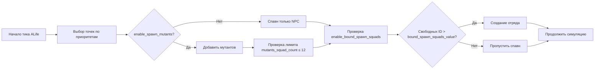

````markdown
# 🔧 Фикс «Not enough IDs / lua_pcall_failed» для S.T.A.L.K.E.R. Global War

**Исправляет**:
- Лавинообразный спавн NPC/мутантов.
- Переполнение пула ALife-ID.
- Ошибки движка:
  - `lua_pcall_failed`
  - `Not enough IDs`
  - `Requesting ID has already been used`
  - Дубли в `Object Registry`.

**Причина**: чрезмерный параллельный спавн отрядов/мутантов → быстрый расход пула ALife-ID → дубли и циклические падения.

**Решение**: замедлить и ограничить спавн, добавить защитные пороги и верхние лимиты, отключить спавн мутантов (по желанию) и оставить приоритеты точек.

---

## 📂 Изменения по файлам

### 1. `gamedata/configs/axr_options.ltx`
```ini
enable_priorities = true               ; Приоритеты точек сохранены (геймплей)
enable_spawn_mutants = false           ; Глобально отключён спавн мутантов
mutants_squad_count = 6                ; Было 20 — снижение для разгрузки симуляции
speed_spawn = 20                       ; Было 80 — меньше резких спавнов
enable_events_with_azazel_mode = false ; Отключаем дополнительные события
enable_bound_spawn_squads = true       ; Включаем защиту от переполнения ID
bound_spawn_squads_value = 1000        ; Порог свободных ID
````

---

### 2. `gamedata/configs/alife.ltx`

```ini
objects_per_update = 10 ; Было 20 — разгрузка тика ALife
process_time = 600      ; Было 900 — распределение нагрузки
```

---

### 3. `gamedata/scripts/sim_brain.script`

* Добавлен верхний лимит на чтение параметра `mutants_squad_count` и варианта «на уровень»: теперь максимум **12**.
* Предохраняет от ошибочных/чрезмерных значений в конфиге.

---

### 4. `gamedata/scripts/sim_smart.script`

* Аналогичный верхний лимит на `mutants_squad_count` (не более **12**).
* Если встретится «жёсткое» значение `20` — принудительно урезается до `12`.

---

### 5. `gamedata/scripts/sim_board.script`

* Перед созданием любого отряда добавлена глобальная проверка остатка свободных ALife-ID:

```lua
if enable_bound_spawn_squads and alife():get_available_count() < bound_spawn_squads_value then
    return -- Пропускаем спавн при нехватке ID
end
```

* Это «аварийный клапан», предотвращающий повторное переполнение пула ID и циклы ошибок.

---

## 📊 Логика защиты ALife-ID

```mermaid
flowchart TD
    A[Начало спавна отряда] --> B{enable_bound_spawn_squads включён?}
    B -- Нет --> G[Спавн отряда]
    B -- Да --> C{alife():get_available_count() < bound_spawn_squads_value?}
    C -- Нет --> G
    C -- Да --> D[Пропустить спавн]
    G --> E[Продолжить симуляцию]
    D --> E
```

**Пояснение**:

1. Проверяется, включена ли защита (`enable_bound_spawn_squads`).
2. Если включена — оценивается количество свободных ALife-ID.
3. Если ID меньше порога (`bound_spawn_squads_value`) — спавн блокируется.
4. Это предотвращает лавинообразное переполнение и ошибки движка.

---

## 🗺 Схема процесса спавна (с приоритетами и мутантами)



**Что изменено в процессе**:

1. **Лимит мутантов**: даже если в конфиге стоит большое значение, в скриптах урезаем до **12**.
2. **Скорость спавна**: `speed_spawn` занижен, чтобы не создавать сотни объектов за тик.
3. **Аварийный клапан**: перед каждым спавном проверяется остаток ALife-ID.
4. **Отключение событий Azazel**: исключаем лишние триггеры, которые инициировали массовые спавны.

---

## 🚀 Как применять и запускать

1. После обновления файлов **очистить кэш**:

   ```
   appdata/shaders_cache_oxr/r3/*
   appdata/shaders_cache_oxr/r4/*
   appdata/cdb_cache/*
   ```
2. Запускать игру и загружать сохранение **до** начала спама ошибок.
   Повреждённые сейвы с переполненными ID часто не восстанавливаются.
3. Дать симуляции «остыть»: 2–3 игровых часа без длительного скипа времени и массовых боёв.

---

## 💡 Рекомендации

* Приоритеты точек оставьте включёнными, но не поднимайте все точки до максимального значения единовременно на нескольких локациях.
* Если захочется вернуть мутантов:

  ```ini
  enable_spawn_mutants = true
  mutants_squad_count = 8 ; Рекомендация: не выше 8–10
  ```

  Лимиты в скриптах всё равно защитят от экстремальных значений.
* Избегайте длительного «скипа времени» в момент, когда активно идёт захват множества точек — это самый частый триггер лавинообразного спавна.

---

## ↩ Откат изменений

* Все правки локальны и обратимы:

  * В `axr_options.ltx` вернуть прежние значения.
  * Удалить `enable_bound_spawn_squads` и `bound_spawn_squads_value`, если защита не нужна.
  * В скриптах можно убрать вставленные проверки/лимиты (поиск по коммиту или ключевым словам выше).

```
